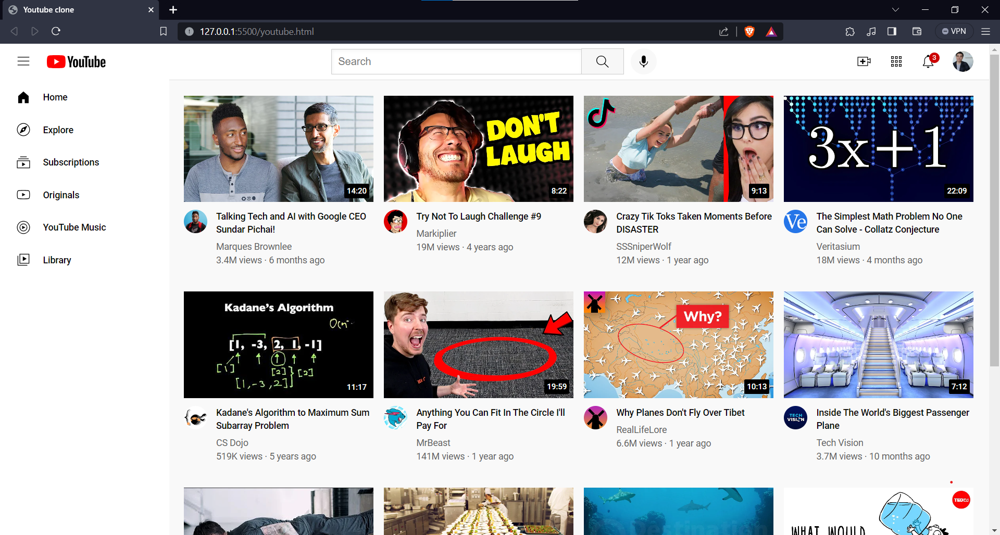

# Youtube-Clone

## Table of Contents
<ul dir="auto">
  <li><a href="#screen-shots">Screen shots</a></li>
  <li><a href="#description">Description</a></li>
  <li><a href="#technologies-used">Technologies used</a></li>
  <li><a href="#author-info">Author Info</a></li>
</ul>

## Screen shots

## Description
A copy of the home page of YouTube design. The project only uses HTML and CSS. It was done to reinforce my knowledge in those languages and learn new techniques to make a professional-looking website. The project is the final result of following the
<a href="https://courses.supersimple.dev/courses/html-css">SuperSimpleDev</a> 
<a href="https://www.youtube.com/watch?v=G3e-cpL7ofc">HTML & CSS Full Course - Beginner to Pro </a>  online course. 

## Technologies used
<ul>
  <li>HTML</li>
  <li>CSS</li>
  <li>Hovers/Transitions</li>
  <li>Nested Layouts</li>
  <li>Nested Flebox</li>
  <li>Grid/Flexbox</li>
  <li>Position Absolute/Relative</li>
</ul>

## Author-info
LinkedIn: www.linkedin.com/in/léandre-benoit
